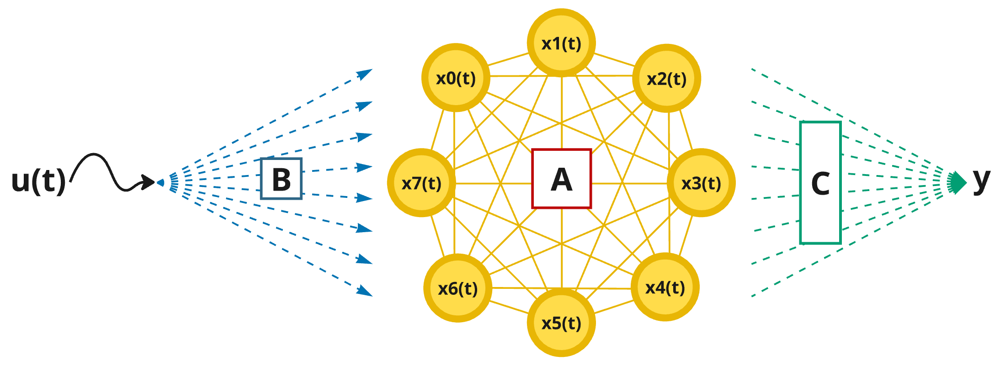

# recurrent-mgd
A simplified repository for training recurrent neural networks (RNNs) with multiplexed gradient descent (MGD), accompanying the paper submission "**Model-Free Multiplexed Gradient Descent: Neuromorphic Learning in Recurrent Networks**" (O'Loughlin et al. 2025).

This repository is adapted from the original research repository, which is itself available upon request.  Tutorial, visualizations, and further datasets incoming soon!  For now, just try running `train.py` for quick example of recurrent-mgd in action.  

### Train a recurrent network like the one vizualized below *without backprop.* 




## Setup

We recommend cloning this repo within a parent directory called `mgd-workspace` so that saved experiements will be grouped outside or your cloned repo, but inside your workspace.

It is also recommended to work within a virtual python environment, which can be initialized as follows:

```
python -m venv .mgd-venv
```
Followed by (for linux/macos)
```
source .mgd-venv/bin/activate
```
or (for windows)
```
 .mgd-venv/Scripts/activate.ps1
```

And then (whether you have elected to utilize an virtual environment or not), the following command can be run to prepare your local machine to use this repository:

```
pip install -e .
```
If you have a NVIDIA GPU with CUDA installed, then run the following command to automatically run all jax code on your GPU.

```
pip install jax[cuda12]
```

*Good to go!*

## Try it out
More content coming soon!  For now, just try running `python train.py` from within the `src` directory for a quick example of recurrent-mgd in action.  You should easily score updwards of 97% on the ECG-5000 binary classification task :)

### *Enjoy!*